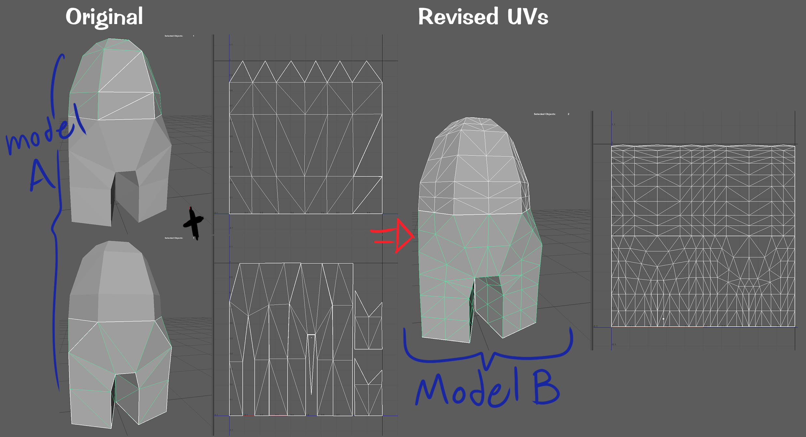

# Assignment # X: Baking Textures Part 2

**Note:** If you haven't checked out the previous baking textures assignment, I HIGHLY recommend you do so first!

Alright, so let's talk for a moment about Toontown shirts. They're just so... weird to work with, am I right? All that stupid distortion, like how can anybody make really good-looking shirts while dealing with that ugly distortion??

Toontown shirt UVs are extremely difficult to work with by hand as it contains an awful amount of distortion. In this assignment, I will go over how to make Toontown shirts while avoiding the dreaded UV distortion.

## Baking Onto Different UV's

  

### How it works

I mentioned the process on texture baking in the previous tutorial, but here's another explanation:

Say we have two models, model A and model B, that are completely identical to each other and are located in the same position such that there's constant Z-fighting going on. Each vertex, edge, and face on model A share identical values with those on model B. The only thing that may differentiate between model A and B are different UVs

Texture baking is the process of transferring texture data from one 3D model to another 3D model.

I made a video explaining this further and how to texture bake in Blender 2.7 however the audio didn't record

https://www.youtube.com/watch?v=RzXoAhYg0a0

## Credit
MAJOR Kudos to PolygonCC for letting me use her better UV-mapped clothing models!
